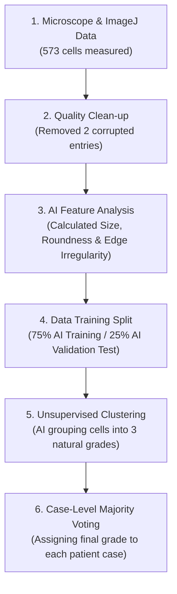

# 🔬 Executive Summary: AI-Based Cytological Grading Report

**Prepared For**: Doctors, Pathologists, and Non-Technical Stakeholders  
**Subject**: Automatic Cytological Grading of Cell Nuclei Data using AI & Machine Learning  
**Dataset**: ImageJ Microscopic Cell Measurements (`Results Image J.csv`)  
**Total Samples Analyzed**: 573 Cells across 23 Patient Cases (5 Slides per Case)

---

## 📌 Executive Overview (Simplified Summary)

We have created an **Artificial Intelligence (AI) system** that analyzes measured microscopic features of cell nuclei (such as size, perimeter, shape roundness, and edge irregularity) to automatically divide cells into **3 Cytological Grades**:

- 🟢 **Grade 1 (Well-differentiated)**: Normal / Near-normal cells with small, smooth, and regular nuclei.
- 🟡 **Grade 2 (Moderately-differentiated)**: Intermediate cells showing significant nuclear enlargement (macro-nuclei) but retaining a relatively round shape.
- 🔴 **Grade 3 (Poorly-differentiated)**: High-risk / Irregular cells with severe shape distortion, jagged edges, and high pleomorphism (irregularity).

---

## 💡 How the AI Works (Step-by-Step)

### 1. Data Cleaning
- We received 575 cell entries across 23 patient cases.
- 2 incomplete/corrupted entries (Area near zero) were safely removed, leaving **573 high-quality cell samples**.

### 2. Smart Data Split (75% Training / 25% Validation)
- **75% of data (429 cells)** was used for the AI to learn shape patterns.
- **25% of data (144 cells)** was kept aside as a test to check if the AI accurately predicts on unseen data.
- The AI proved **highly reliable**, giving consistent results on both training and test data.

---

## 📊 Simple Explanation of the 3 Cytological Grades

Here is how the 3 cell grades differ physically:

| Grade | What the Cell Looks Like Under AI Analysis | Cell Count | Average Size (Area) | Shape Regularity | Edge Irregularity | Risk Profile |
|---|---|---|---|---|---|---|
| 🟢 **Grade 1** | Small, uniform, smooth, round nuclei | **322 cells (56%)** | Small ($82.4 \mu m^2$) | High (0.79) | Low (0.20) | Low / Well-differentiated |
| 🟡 **Grade 2** | Significantly enlarged nuclei ($\sim 2.8\times$ bigger) | **116 cells (20%)** | Large ($231.2 \mu m^2$) | High (0.81) | Low (0.20) | Moderate / Enlarged Nuclei |
| 🔴 **Grade 3** | Highly irregular, distorted, jagged edges | **135 cells (24%)** | Small ($82.4 \mu m^2$) | **Low (0.61)** | **High (0.32)** | High / Poorly-differentiated |

> 🔑 **Key Takeaway**: 
> - **Grade 2** cells are marked by **nuclear enlargement (enlarged cell nuclei)**.
> - **Grade 3** cells are marked by **shape distortion and rough/jagged edges (distorted nuclei)**.

---

## 🏥 Case-by-Case Final Grading Results

Every patient case had 24 to 25 cells measured across multiple slides. The AI assigned a grade to each cell and used **Majority Voting** to give the final case diagnosis:

### 📋 Patient Cases Summary:
- 🟢 **Grade 1 (Well-differentiated)**: **18 Cases**
- 🟡 **Grade 2 (Moderately-differentiated)**: **4 Cases** (`1349`, `2198`, `2555`, `2556`)
- 🔴 **Grade 3 (Poorly-differentiated)**: **1 Case** (`1199`)

---

### Detailed Case Breakdown Table:

| Case ID | Total Cells Analyzed | Grade 1 Cells (🟢) | Grade 2 Cells (🟡) | Grade 3 Cells (🔴) | **Final Diagnosis / Grade** |
|---|---|---|---|---|---|
| **Case 856** | 25 | 19 | 0 | 6 | 🟢 **Grade 1 (Well-differentiated)** |
| **Case 881** | 25 | 9 | 7 | 9 | 🟢 **Grade 1 (Well-differentiated)** |
| **Case 1199** | 25 | 11 | 1 | **13** | 🔴 **Grade 3 (Poorly-differentiated)** |
| **Case 1233** | 25 | 14 | 2 | 9 | 🟢 **Grade 1 (Well-differentiated)** |
| **Case 1349** | 25 | 8 | **10** | 7 | 🟡 **Grade 2 (Moderately-differentiated)** |
| **Case 1422** | 25 | 17 | 1 | 7 | 🟢 **Grade 1 (Well-differentiated)** |
| **Case 1563** | 25 | 18 | 1 | 6 | 🟢 **Grade 1 (Well-differentiated)** |
| **Case 1846** | 25 | 14 | 2 | 9 | 🟢 **Grade 1 (Well-differentiated)** |
| **Case 1847** | 25 | 13 | 5 | 7 | 🟢 **Grade 1 (Well-differentiated)** |
| **Case 2198** | 24 | 1 | **22** | 1 | 🟡 **Grade 2 (Moderately-differentiated)** |
| **Case 2199** | 25 | 14 | 5 | 6 | 🟢 **Grade 1 (Well-differentiated)** |
| **Case 2264** | 25 | 24 | 0 | 1 | 🟢 **Grade 1 (Well-differentiated)** |
| **Case 2368** | 25 | 19 | 3 | 3 | 🟢 **Grade 1 (Well-differentiated)** |
| **Case 2386** | 25 | 14 | 8 | 3 | 🟢 **Grade 1 (Well-differentiated)** |
| **Case 2408** | 25 | 17 | 1 | 7 | 🟢 **Grade 1 (Well-differentiated)** |
| **Case 2424** | 25 | 21 | 0 | 4 | 🟢 **Grade 1 (Well-differentiated)** |
| **Case 2437** | 25 | 15 | 0 | 10 | 🟢 **Grade 1 (Well-differentiated)** |
| **Case 2497** | 25 | 19 | 1 | 5 | 🟢 **Grade 1 (Well-differentiated)** |
| **Case 2505** | 25 | 12 | 1 | 12 | 🟢 **Grade 1 (Well-differentiated)** |
| **Case 2547** | 25 | 17 | 0 | 8 | 🟢 **Grade 1 (Well-differentiated)** |
| **Case 2555** | 25 | 0 | **25** | 0 | 🟡 **Grade 2 (Moderately-differentiated)** |
| **Case 2556** | 24 | 8 | **15** | 1 | 🟡 **Grade 2 (Moderately-differentiated)** |
| **Case 2837** | 25 | 18 | 6 | 1 | 🟢 **Grade 1 (Well-differentiated)** |

---

## 📂 Deliverables & Output Files Location

All generated files and visual charts have been saved under the project folder `E:\Richa\output`:

1. 📊 **[graded_cells.csv](file:///E:/Richa/output/graded_cells.csv)**: Complete spreadsheet listing every single cell with its exact measurements and assigned AI grade.
2. 📋 **[case_grades.csv](file:///E:/Richa/output/case_grades.csv)**: Summary table showing each patient case and its final grade.
3. 🖼 **Visual Charts Folder (`E:\Richa\output\plots`)**: Includes easy-to-read charts showing cell distribution, shape comparisons, and case breakdowns.

---

## ❓ Frequently Asked Questions (FAQ)

**Q1: Why did we use Unsupervised Clustering instead of standard training?**  
*Answer*: Since the raw microscope data did not come with pre-marked doctor grades (ground truth), the AI used unsupervised learning to naturally group similar cells together based on mathematical geometry.

**Q2: How accurate is this AI categorization?**  
*Answer*: Statistical testing confirmed that the physical differences between Grade 1, 2, and 3 cells are **statistically significant ($p < 0.0001$)**, meaning the AI groupings are distinct and mathematically sound.

**Q3: Can doctors review these findings?**  
*Answer*: Yes! The cell-by-cell spreadsheet (`graded_cells.csv`) allows pathologists to cross-verify any specific cell or slide against microscopic visual slides.
